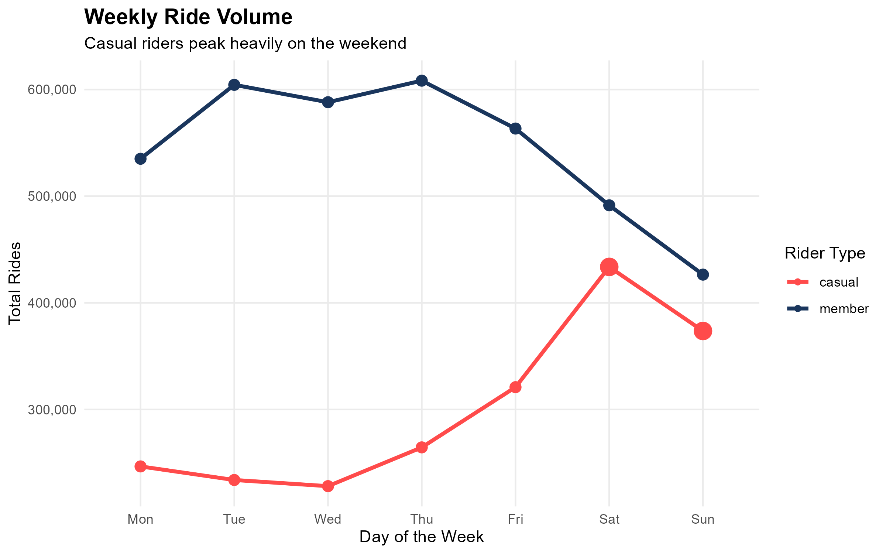
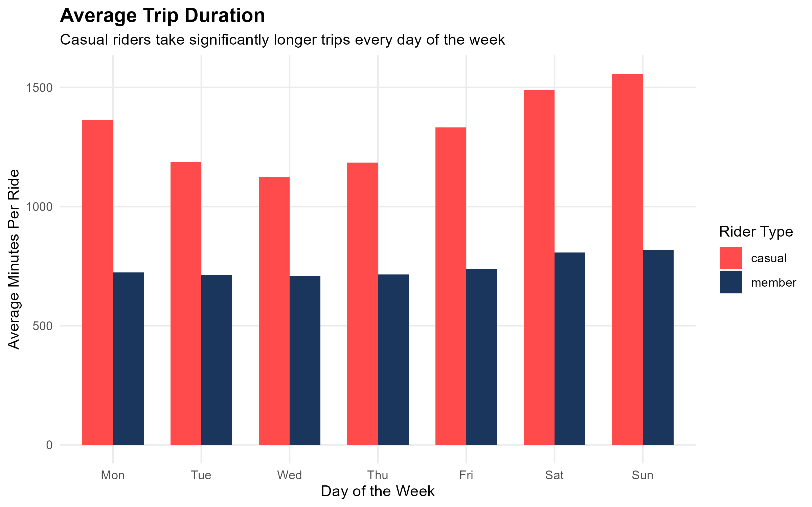

# Cyclistic User Trends
### Uncovering ridership patterns to drive membership growth for Chicago’s leading bike-share service.
---
## 1. Ask
*   **Business Task:** Analyze how casual riders and annual members use Cyclistic bikes differently.
*   **Goal:** Answer the question "How do annual members and casual riders use Cyclistic bikes differently?".
---
## 2. Prepare
*   **Data Source:** 12 months of historical Cyclistic trip data.
*   **Data Integrity:** Data is public, verified, and structured consistently across monthly releases.
*   **Constraints:** To protect user privacy, no personally identifiable information or financial data was accessible. This limits us in the manner that we cannot track if the same casual rider buys multiple single passes.
---
## 3. Process
*   **Tools:** R (RStudio).
*   **Scale:** Successfully cleaned, processed, and merged **5,147,004 rows** of raw data.
*   **Data Cleaning Checklist:**
    *   Combined 12 separate monthly datasets into a single master dataframe.
    *   Formatted raw timestamps into standardized date/time variables.
    *   Extracted key analysis features: `day_of_week` and trip duration (`ride_length`).
    *   Removed data noise, including duplicates and 29 erroneous rows with negative ride lengths.
    *   Handled missing values using `na.omit()` to ensure the results were clean and accurate.

---

## 4. Analyze & 5. Share
By processing the full year of data, two obvious behavioral divides stood out between casual and annual members:

### Key Finding 1: The Weekend Spike vs. The Weekday Grind
Annual members provide a steady, predictable baseline of demand Monday through Friday, matching a standard working commuter profile. Casual riders, however, are "Weekend Warriors" as their volume drastically increases on Saturday and Sunday.

### Key Finding 2: The Trip Duration Gap
While members are efficient, casual riders stay out more than **twice as long**. On average, casual trips last roughly 25 minutes, compared to a quick 12-minute average for members. This duration gap remains true every single day of the week.

> **The Takeaway:** These distinct patterns prove a clear difference in intent. Annual members use Cyclistic as a utility for daily commuting. Casual riders use it as an experience for leisure, exercise, and weekend exploring.

---

## 6. Act
To successfully convert casual riders into annual members, the marketing team should move away from generic campaigns and target the specific weekend/leisure habits uncovered in the data:

1.  **The "Weekend Warrior" Membership:** Introduce a targeted, lower-tier annual membership that specifically offers unlimited Friday–Sunday rides. This captures the high-volume weekend casual demographic without forcing them into a full 7-day commuter pass they don't need.
2.  **Seasonal Summer Promotions:** Since casual trip lengths and volumes peak heavily during leisure months, launch digital marketing campaigns at high-traffic waterfront or park stations during late spring and summer.
3.  **App-Based Invoicing Triggers:** Use the ride data to trigger targeted in-app promotions. If a non-member account clocks more than two 25+ minute rides in a single month, hit them with a notification showing how much money they would have saved by converting to a member.

<b>Click to view the full R processing script</b>

### Combine all 12 monthly CSV files into one single dataset:
bike_data <- list.files(path = "C:/Users/JHube/OneDrive/Desktop/Cycle_Data", pattern = "*.csv", full.names = TRUE) %>% 
  lapply(read_csv) %>% 
  bind_rows()

### Load required libraries:
library(tidyverse)
library(lubridate)

### Filter out rows where ride length is missing or negative:
bike_data_clean <- bike_data %>%
  filter(!is.na(ride_length) & ride_length > 0) %>%
  filter(!is.na(day_of_week)) %>%
  distinct()

### Order the days of the week chronologically:
bike_data_clean$day_of_week <- factor(bike_data_clean$day_of_week, 
  levels = c("Monday", "Tuesday", "Wednesday", "Thursday", "Friday", "Saturday", "Sunday"))

### Summarize cleaned data and plot weekly ride trends with custom weekend highlighting:
bike_data_clean %>% 
  mutate(day_of_week = factor(day_of_week, levels = c("Monday", "Tuesday", "Wednesday", "Thursday", "Friday", "Saturday", "Sunday"))) %>% 
  group_by(day_of_week, member_casual) %>% 
  summarise(number_of_rides = n(), .groups = 'drop') %>% 
  mutate(is_weekend = day_of_week %in% c("Saturday", "Sunday")) %>% 
  ggplot(aes(x = day_of_week, y = number_of_rides, color = member_casual, group = member_casual)) +
  geom_line(size = 1.2) +
  geom_point(aes(size = ifelse(is_weekend & member_casual == "casual", 5, 3))) + 
  scale_y_continuous(labels = scales::comma) +
  scale_x_discrete(labels = c("Monday" = "Mon", "Tuesday" = "Tue", "Wednesday" = "Wed", "Thursday" = "Thu", "Friday" = "Fri", "Saturday" = "Sat", "Sunday" = "Sun")) +
  scale_color_manual(values = c("casual" = "#FF4B4B", "member" = "#1A365D")) + 
  scale_size_identity() +
  labs(
    title = "Weekly Ride Volume",
    subtitle = "Casual riders peak heavily on the weekend",
    x = "Day of the Week", 
    y = "Total Rides", 
    color = "Rider Type"
  ) +
  theme_minimal() +
  theme(
    plot.title = element_text(face = "bold", size = 14),
    panel.grid.minor = element_blank()
  )

### Plot a side-by-side bar chart comparing raw ride counts by day and user type:
bike_data_clean %>% 
  mutate(day_of_week = factor(day_of_week, levels = c("Monday", "Tuesday", "Wednesday", "Thursday", "Friday", "Saturday", "Sunday"))) %>% 
  group_by(day_of_week, member_casual) %>% 
  summarise(avg_duration = mean(ride_length, na.rm = TRUE), .groups = 'drop') %>% 
  ggplot(aes(x = day_of_week, y = avg_duration, fill = member_casual)) +
  geom_col(position = "dodge", width = 0.7) +
  scale_x_discrete(labels = c("Monday" = "Mon", "Tuesday" = "Tue", "Wednesday" = "Wed", "Thursday" = "Thu", "Friday" = "Fri", "Saturday" = "Sat", "Sunday" = "Sun")) +
  scale_fill_manual(values = c("casual" = "#FF4B4B", "member" = "#1A365D")) +
  labs(
    title = "Average Trip Duration",
    subtitle = "Casual riders take significantly longer trips every day of the week",
    x = "Day of the Week",
    y = "Average Minutes Per Ride",
    fill = "Rider Type"
  ) +
  theme_minimal() +
  theme(
    plot.title = element_text(face = "bold", size = 14),
    panel.grid.minor = element_blank()
  )
